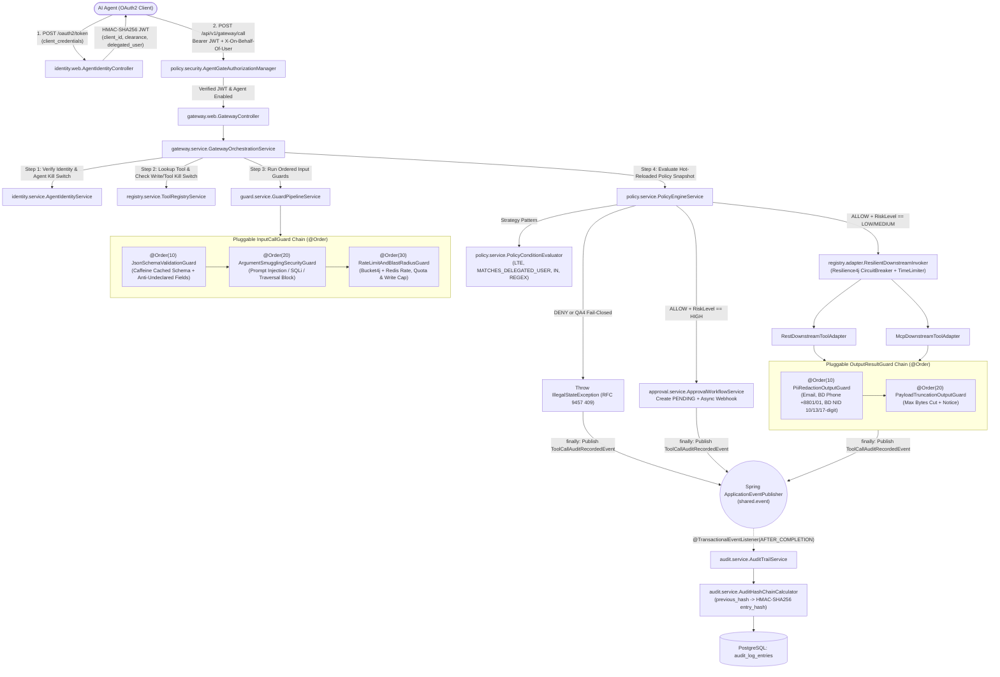
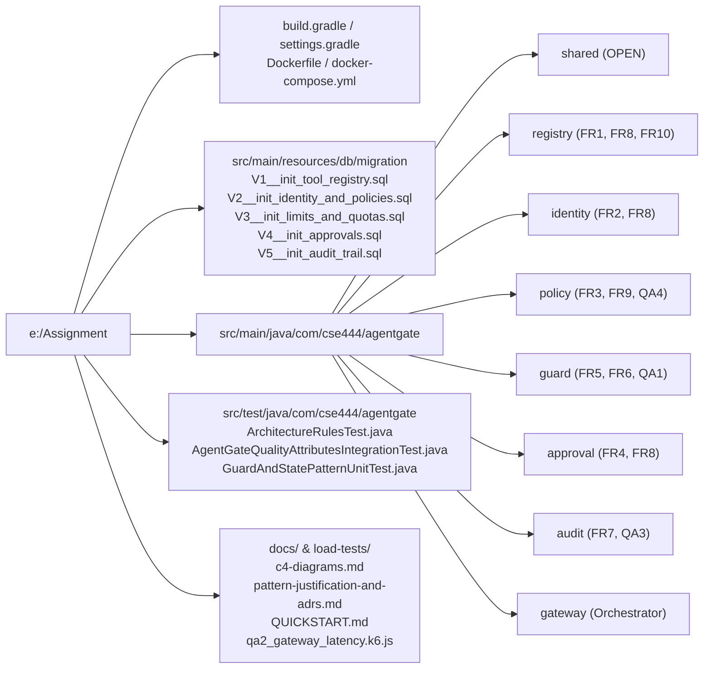

# AgentGate — Component Architecture, API Data Flow & Directory Graph

## 1. End-to-End Tool Call Governance Pipeline Flow

```mermaid
flowchart TD
    Agent(["AI Agent (OAuth2 Client)"]) -->|"1. POST /oauth2/token\n(client_credentials)"| AuthCtrl["identity.web.AgentIdentityController"]
    AuthCtrl -->|"HMAC-SHA256 JWT\n(client_id, clearance, delegated_user)"| Agent

    Agent -->|"2. POST /api/v1/gateway/call\nBearer JWT + X-On-Behalf-Of-User"| SecFilter["policy.security.AgentGateAuthorizationManager"]
    SecFilter -->|"Verified JWT & Agent Enabled"| GwCtrl["gateway.web.GatewayController"]
    GwCtrl --> GwSvc["gateway.service.GatewayOrchestrationService"]

    GwSvc -->|"Step 1: Verify Identity & Agent Kill Switch"| IdSvc["identity.service.AgentIdentityService"]
    GwSvc -->|"Step 2: Lookup Tool & Check Write/Tool Kill Switch"| RegSvc["registry.service.ToolRegistryService"]
    GwSvc -->|"Step 3: Run Ordered Input Guards"| GuardSvc["guard.service.GuardPipelineService"]

    subgraph InputGuardChain["Pluggable InputCallGuard Chain (@Order)"]
        G1["@Order(10) JsonSchemaValidationGuard\n(Caffeine Cached Schema + Anti-Undeclared Fields)"]
        G2["@Order(20) ArgumentSmugglingSecurityGuard\n(Prompt Injection / SQLi / Traversal Block)"]
        G3["@Order(30) RateLimitAndBlastRadiusGuard\n(Bucket4j + Redis Rate, Quota & Write Cap)"]
        G1 --> G2 --> G3
    end
    GuardSvc --> InputGuardChain

    GwSvc -->|"Step 4: Evaluate Hot-Reloaded Policy Snapshot"| PolSvc["policy.service.PolicyEngineService"]
    PolSvc -->|"Strategy Pattern"| CondEval["policy.service.PolicyConditionEvaluator\n(LTE, MATCHES_DELEGATED_USER, IN, REGEX)"]

    PolSvc -->|"DENY or QA4 Fail-Closed"| DenyBlock["Throw IllegalStateException (RFC 9457 409)"]
    PolSvc -->|"ALLOW + RiskLevel == HIGH"| ApprovalPause["approval.service.ApprovalWorkflowService\nCreate PENDING + Async Webhook"]
    PolSvc -->|"ALLOW + RiskLevel == LOW/MEDIUM"|ResilientExec["registry.adapter.ResilientDownstreamInvoker\n(Resilience4j CircuitBreaker + TimeLimiter)"]

    ResilientExec --> RestAdp["RestDownstreamToolAdapter"]
    ResilientExec --> McpAdp["McpDownstreamToolAdapter"]

    RestAdp & McpAdp --> OutputGuardChain
    subgraph OutputGuardChain["Pluggable OutputResultGuard Chain (@Order)"]
        OG1["@Order(10) PiiRedactionOutputGuard\n(Email, BD Phone +8801/01, BD NID 10/13/17-digit)"]
        OG2["@Order(20) PayloadTruncationOutputGuard\n(Max Bytes Cut + Notice)"]
        OG1 --> OG2
    end

    DenyBlock & ApprovalPause & OutputGuardChain -->|"finally: Publish ToolCallAuditRecordedEvent"| EventBus(("Spring ApplicationEventPublisher\n(shared.event)"))

    EventBus -.->|"@TransactionalEventListener(AFTER_COMPLETION)"| AuditSvc["audit.service.AuditTrailService"]
    AuditSvc --> HashCalc["audit.service.AuditHashChainCalculator\n(previous_hash -> HMAC-SHA256 entry_hash)"]
    HashCalc --> AuditDB[("PostgreSQL: audit_log_entries")]
```

---

## 2. Workspace Directory & Module Structure Graph

```mermaid
flowchart LR
    Root["e:/Assignment"] --> Build["build.gradle / settings.gradle\nDockerfile / docker-compose.yml"]
    Root --> Migrations["src/main/resources/db/migration\nV1__init_tool_registry.sql\nV2__init_identity_and_policies.sql\nV3__init_limits_and_quotas.sql\nV4__init_approvals.sql\nV5__init_audit_trail.sql"]
    Root --> Src["src/main/java/com/cse444/agentgate"]
    Root --> Tests["src/test/java/com/cse444/agentgate\nArchitectureRulesTest.java\nAgentGateQualityAttributesIntegrationTest.java\nGuardAndStatePatternUnitTest.java"]
    Root --> Docs["docs/ & load-tests/\nc4-diagrams.md\npattern-justification-and-adrs.md\nQUICKSTART.md\nqa2_gateway_latency.k6.js"]

    Src --> MShared["shared (OPEN)"]
    Src --> MRegistry["registry (FR1, FR8, FR10)"]
    Src --> MIdentity["identity (FR2, FR8)"]
    Src --> MPolicy["policy (FR3, FR9, QA4)"]
    Src --> MGuard["guard (FR5, FR6, QA1)"]
    Src --> MApproval["approval (FR4, FR8)"]
    Src --> MAudit["audit (FR7, QA3)"]
    Src --> MGateway["gateway (Orchestrator)"]
```
